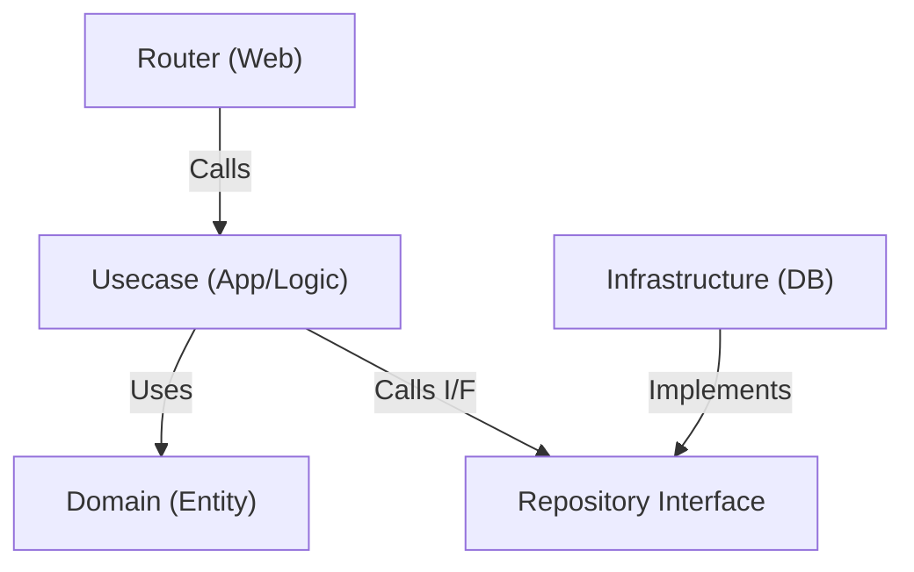

# Backend Architecture

本プロジェクトでは、**Simplified Clean Architecture** (軽量化されたレイヤードアーキテクチャ) を採用します。
初期開発の速度と、将来的な保守性のバランスを考慮し、Service レイヤーを Usecase レイヤーに統合しています。

## レイヤー構成

## 各レイヤーの責務

### 1. Router (`backend/app/router/`)
- **役割**: HTTP リクエストのハンドリング。
- **責務**:
    - リクエストデータのバリデーション（Pydantic）
    - Usecase の呼び出し
    - レスポンスの整形
- **ルール**: ビジネスロジックを含まない。

### 2. Usecase (`backend/app/usecase/`)
- **役割**: アプリケーションの機能単位、およびビジネスルールの実装。
- **責務**:
    - アプリケーションの処理フロー制御
    - ドメインルール（ビジネスロジック）の適用
    - Repository Interface を介したデータの永続化・取得
- **簡素化**: ドメインサービス（Service層）を個別に設けず、ここに含まれるものとします。

### 3. Domain (`backend/app/domain/`)
- **役割**: ドメインの中核モデルとインターフェース定義。
- **責務**:
    - `Entity` (データ構造と振る舞い)
    - `Repository Interface` (データの保存・取得の抽象定義)
- **ルール**: 外部ライブラリやフレームワーク（SQLAlchemyなど）に依存しない。

### 4. Infrastructure (`backend/app/infrastructure/`)
- **役割**: 技術的詳細の実装。
- **責務**:
    - Repository Interface の実装（SQLAlchemy, API Client 等）
    - 外部システムとの通信
