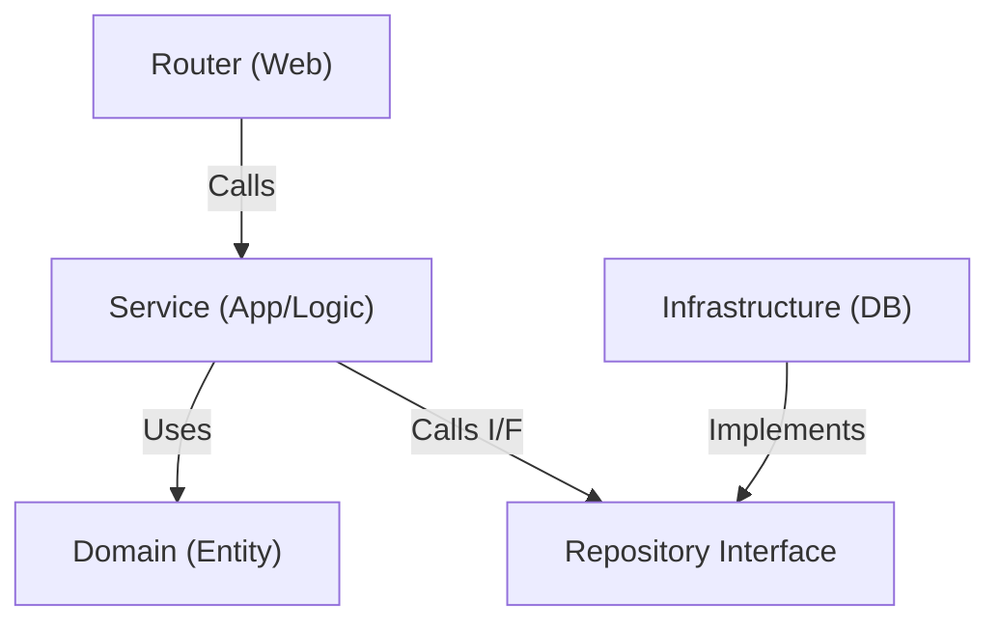

# Backend Architecture

本プロジェクトでは、**Simplified Clean Architecture** (軽量化されたレイヤードアーキテクチャ) を採用します。
初期開発の速度と、将来的な保守性のバランスを考慮し、Service レイヤーを Usecase レイヤーに統合しています。

## レイヤー構成



## 各レイヤーの責務

### 1. Router (`backend/app/router/`)
- **役割**: HTTP リクエストのハンドリング。
- **責務**:
    - リクエストデータのバリデーション（Pydantic）
    - Service の呼び出し
    - レスポンスの整形
- **ルール**: ビジネスロジックを含まない。

### 2. Service (`backend/app/service/`)
- **役割**: アプリケーションの機能単位、およびビジネスルールの実装。
- **責務**:
    - アプリケーションの処理フロー制御
    - ドメインルール（ビジネスロジック）の適用
    - Repository Interface を介したデータの永続化・取得
- **簡素化**: ドメインサービス（Service層）を個別に設けず、ここに含まれるものとします。

### 3. Domain (`backend/app/domain/`)
- **役割**: ドメインの中核モデルとインターフェース定義。
- **責務**:
    - `Entity` (データ構造と振る舞い)
    - `Repository Interface` (データの保存・取得の抽象定義)
- **ルール**: 外部ライブラリやフレームワーク（SQLAlchemyなど）に依存しない。

### 4. Infrastructure (`backend/app/infrastructure/`)
- **役割**: 技術的詳細の実装。
- **責務**:
    - Repository Interface の実装（SQLAlchemy, API Client 等）
    - 外部システムとの通信

## トランザクション管理とサービスの粒度
「投稿 (Post) と一緒に画像 (Image) やファイル (Zip) を保存する」といった複合的な処理の場合：

1.  **Service の粒度**: **「1つのユースケース（ユーザーの意図） = 1つの Service メソッド」** となります。
    *   例: `PostService.create_full_post(...)`
    *   Router から ImageService, FileService を個別に呼ぶのではなく、PostService が責任を持ちます。
2.  **トランザクション**: **Service 層がトランザクションの境界**となります。
    *   Service メソッド内で、`PostRepository.save()`, `ImageRepository.save()` などを連続して呼び出し、全て成功したらコミット、失敗したらロールバックします（Atomicity）。

```python
# 擬似コード例
class PostService:
    def create_full_post(self, post_data, images, zip_file):
        with self.uow.begin():  # トランザクション開始
            post = self.post_repo.create(post_data)
            self.image_repo.create_bulk(images, post_id=post.id)
            self.file_repo.save(zip_file, post_id=post.id)
```

## Service の命名規則 (Guidelines)
基本的には **「扱うリソース（ドメイン概念）の集合」** に基づいて命名します。
DBのテーブルと 1:1 である必要はありません。

### 推奨パターン
- **リソースベース**: `UserService` (ユーザー管理), `PostService` (記事管理)
    - 最も一般的。CRUD が中心の場合に自然です。
- **機能ベース**: `AuthService` (認証), `NotificationService` (通知), `SearchService` (検索)
    - 複数のリソース（テーブル）を横断する機能の場合、機能名でサービスを作ります。
    - 例: `AuthService` は、`User` テーブルだけでなく `Session` や `AuditLog` テーブルも扱うかもしれません。

### アンチパターン
- **テーブル名そのまま**: `UserTableService`, `MtmUserRelService`
    - 実装詳細が漏れています。「何をするか」に注目すべきです。
- **巨大な神クラス**: `ManagerService`, `AppService`
    - 責務が不明瞭になり、何でも屋になってしまいます。分けましょう。
